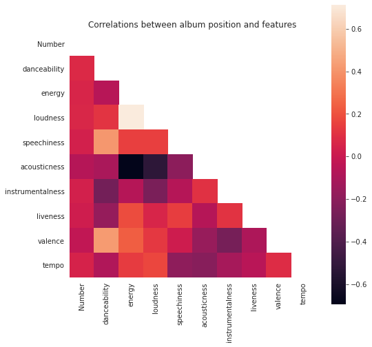
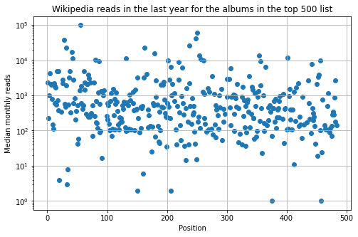

# The 500 Greatest Albums of All Time 
## An exercise of analysis of the database with extra information gathered using the Spotify and Wikipedia APIs

In an special issue of the American magazine Rolling Stone in 2003, it was presented a list with the top 500 albums of all time. This selection was made with the vote of rock stats, musical critics, and personalities from the industry. 

https://www.rollingstone.com/music/music-lists/500-greatest-albums-of-all-time-156826/

This forms a music database of albums of great quality. In this exercise of data visualization, I analyzed whether there are intrinsic features that make an album great. I decided to check several musical features and checked whether in this list there is a relation between the features and the position of the album in the top 500. This information is gathered using the Spotify API. Each track in each album has some metrics about danceability, energy, loudness, speechiness, acousticness, instrumentalness, liveness, valence and tempo, so I can check possible relations. 

In addition, I analyzed whether the top albums show different Wikipedia read metric according to its position. This can allow me to investigate if the knowledge interest based on the Wikipedia page view is correlated with the list position. I gathered this information using the Wikipedia API. 

The data cleaning and improvement procedure is shown in detail in the `data-cleaning` notebook, and the analysis of the dataset is detailed in the `data-analysis` one.

## Data cleaning 

I obtained a CSV with the top 500 albums in the Kaggle website, through the following link:

https://www.kaggle.com/notgibs/500-greatest-albums-of-all-time-rolling-stone?select=albumlist.csv

I conducted some simple cleaning of this dataset to remove some bad characters, to divide different genres and subgenres into lists and remove all albums that aren't present in the Spotify catalogue.

## Improving the database with the APIs from Spotify and Wikipedia

To complete the dataset, I gathered information about each track in each album on the list to compute the musical features of each album using the Spotify API and the `spotipy` library and using and ID and secret keys. I obtained the monthly number of Wikipedia page reads in Spain using its API, that did not require any tokens.

## Analysis of the top 500 improved database

By representing the information gathered from each track of each album versus the position in the list, **I did not find any trend. It seems like there is no "formula" to predict that an album is going to have better reviews based on danceability, energy, loudness, etc.**

With respect to the spanish Wikipedia reads, I obtained the same as before: **being a critically acclaimed album does not translate in more interest to read more about it.**

## Final thoughts

APIs and web scraping have a lot of potential to enhance datasets, and hence helps to find relations and useful information.

I tried to use the standard deviation of the musical features as well, but it seems that sometimes the connection to the database fails when the code is gathering lots of information. Due to limit constraints I stuck with the median of the features, but based on this analysis I don't think that there is a clear relation. It would be a good exercise for another occasion.

